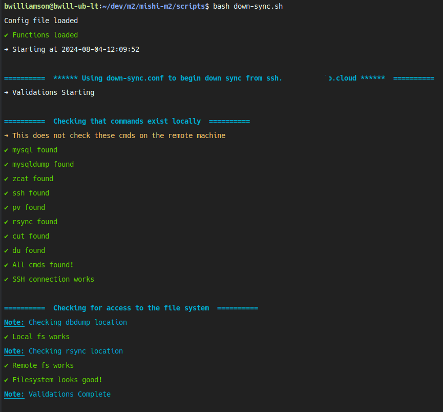
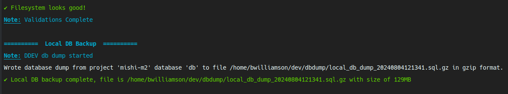
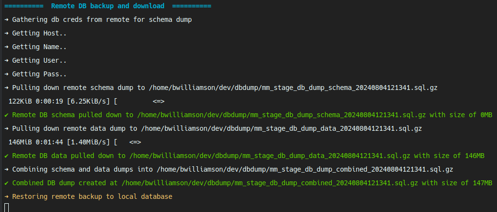
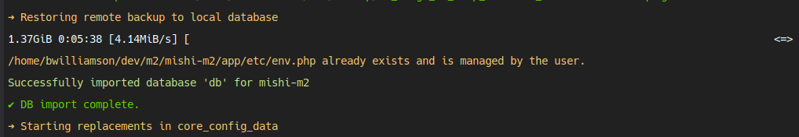
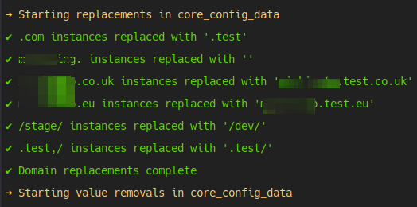
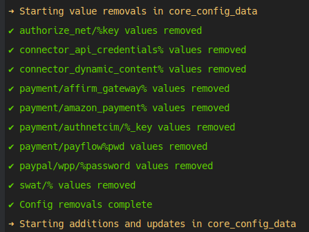
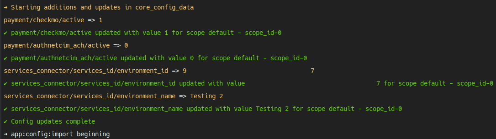
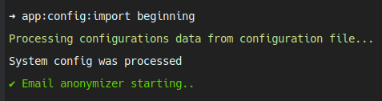
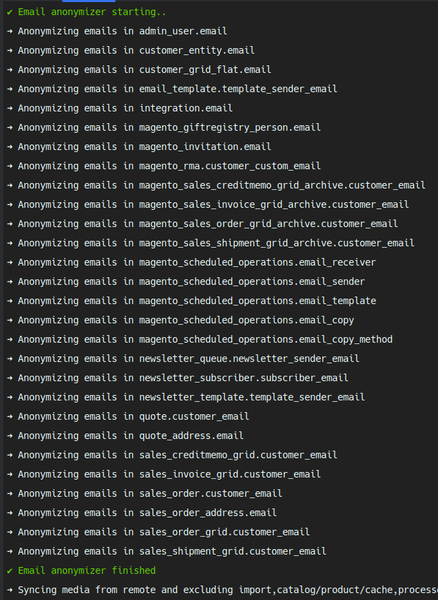
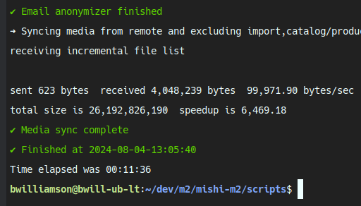

# magento-down-sync
A few bash scripts we use in Magento projects to safely sync staging or production into a local project.

## Table of Contents

- [magento-down-sync](#magento-down-sync)
  - [Table of Contents](#table-of-contents)
  - [Overview](#overview)
  - [Features](#features)
  - [Prerequisites](#prerequisites)
  - [Configuration and Usage](#configuration-and-usage)
    - [Configuration:](#configuration)
  - [What it do](#what-it-do)
    - [Verifies configuration and commands](#verifies-configuration-and-commands)
      - [What are these commands for anyway?](#what-are-these-commands-for-anyway)
    - [Creates a backup of the local DB](#creates-a-backup-of-the-local-db)
    - [Creates a backup of the remote DB](#creates-a-backup-of-the-remote-db)
    - [Restores the remote DB backup to the local DB](#restores-the-remote-db-backup-to-the-local-db)
    - [Removes the DB dump files](#removes-the-db-dump-files)
    - [Replaces values in core\_config\_data](#replaces-values-in-core_config_data)
    - [Removes values from core\_config\_data](#removes-values-from-core_config_data)
    - [Upserts values to core\_config\_data](#upserts-values-to-core_config_data)
    - [Runs app:config:import](#runs-appconfigimport)
    - [Anonymizes email addresses](#anonymizes-email-addresses)
    - [Syncs media files](#syncs-media-files)
    - [Gives timestamps and time elapsed](#gives-timestamps-and-time-elapsed)
  - [Detailed configuration reference](#detailed-configuration-reference)
    - [Local Details](#local-details)
    - [Remote Details](#remote-details)
    - [Backup Details](#backup-details)
    - [Email Scrambler](#email-scrambler)
    - [Media Sync](#media-sync)
    - [Core Config Preservation](#core-config-preservation)
    - [Core Config Data Replacements](#core-config-data-replacements)
    - [Core Config Data Removals](#core-config-data-removals)
    - [Additional Config Values](#additional-config-values)
    - [Strip configuration](#strip-configuration)

## Overview

The `down-sync.sh` script is designed to sync remote Magento environments' Media and Databases to a local development environment. This script is for developers working with Magento projects, especially Adobe commerce projects, who need or want to sync their local development environment with a staging or production environment.

**This does not include the ability to sync code.** You should use a version control system like Git to manage code changes.

## Features
- **Backup**: The script will create a backup of the local database and media files.
- **Graceful error handling**: The script will stop if an error occurs and provide a message and an opportunity to bail out. 
- Pretty colors.
- **Database Sync**: The script will dump the remote database, download it, and import it into the local database.
- **Media Sync**: The script will sync the media files from the remote environment to the local environment.
- **Email Scrambler**: Anonymize email addresses in the database.
- **Core Config Preservation**: Preserve core_config_data table and restore after downsync.
- **Core Config Data Replacements**: Replace values in core_config_data table.
- **Core Config Data Removals**: Remove values in core_config_data table.
- **Additional Config Values**: Add values to core_config_data table.

## Prerequisites
1. A valid SSH key to connect to the remote environment.
2. ***Your crypt key in app/etc/env.php `should` match the remote environment.***  
    - This is necessary to decrypt the encrypted DB values in some cases, such as the keys for Adobe Live Search configuration.
    - Simply copy the crypt key from the remote environment's `app/etc/env.php` file to your local `app/etc/env.php` file. NOTE: you must run `bin/magento cache:flush` after updating the crypt key.
    - This is SHOULD not MUST because the core required config values do not need decryption. Generally speaking only the API keys and other sensitive values are encrypted.
3. The script is run from the destination (local) machine.
4. Install dependencies: `pv`, `gzip`, `ssh`, `mysqldump`, `n98-magerun2.phar`  
    - `pv` is used to show progress bars for file transfers.
    - `gzip` is used to compress the database dump.
    - `ssh` is used to connect to the remote server.
    - `mysqldump` is used to dump the database.
    - `n98-magerun2.phar` is used to pull the database credentials from the Magento project, export the db stripped, and run configuration commands. *This is included in this project if you don't have it already.*
5. Your local Magento project should be set up enough to run `bin/magento` and `n98-magerun2.phar` commands. 
  
**DDEV is preferred for local development.**

```bash
## Install dependencies
# For Ubuntu
sudo apt-get install pv gzip ssh mysql-client
# Or for MacOS
brew install pv gzip mysql-client
# Or for CentOS
yum install pv gzip mysql-client
```

## Configuration and Usage

**Clone the Repository**:  
   Ensure you have the repository cloned to your local machine.
```bash
   git clone https://github.com/Bwilliamson55/magento-down-sync.git <repository-directory>
   cd <repository-directory>
   # or 
   cd $_
```
  We normally place the `/scripts` folder in the root of the Magento project, but you can place it anywhere you like.   

### Configuration:  
   Copy the `down-sync.conf.example` file to `down-sync.conf` and update the configuration values. The file is explicit in what each value is used for, and values that are required are marked with UPDATEME.

**Permissions** :  
   Ensure the scripts have the correct permissions to execute. 
```bash
   chmod +x down-sync.sh
```
**To Run the script** :  
   Run the script with the following command:
```bash
    bash down-sync.sh
```

## What it do
*In detail*   

The down-sync script is designed to be run on a whim, once properly configured with all your necessary config value replacements and additions, so you can do more dev and less syncing.  
This section of the readme will outline the steps the script takes to sync your remote environment to your local environment.

### Verifies configuration and commands
The script will verify that the configuration file is present and that all required values are set. If any required values are missing, the script will die safely and provide a message as to why. Some configuration values if missing are considered false.  
The main script, and the utility scripts, will also verify that the necessary commands are available on the system. If any are missing, the script will die safely and provide a message.
  

#### What are these commands for anyway?
At the risk of being a bit patronizing, I'll save some of you the trouble of googling these.
- `mysql`, in the case of this script, is not technically needed, but may be by n98-magerun2.
- `mysqldump`, this is used explicitly in the script for when you choose to retain your current core_config_data table, but also by n98-magerun2.
- `zcat`, is needed if you're on linux or something similar to unpack a .gz and echo it into the console at the same time. If you're on macos you may need to change this in the .conf to `gzcat`.
- `ssh`, this is to ssh into the remote machines
- `pv`, this is to give a pretty loading bar for the longer running operations
- `rsync`, this is only used in the media-sync portion of the script, to incrementally transfer `pub/media`(or your configured media path) to your local environment
- `cut`, this is necessary for the script to parse the output of `n98-magerun2.phar` to get the database credentials when pulling the remote DB
- `du`, this is used to get the size of the produced files during backups for pretty feedback in the console
> You can add or edit the commands tested in the .conf via the `required_cmds_test` array.

### Creates a backup of the local DB
After the initial checks are complete and happy, if the configuration value for `skip_local_db_dump` is `0`, the script will take a full backup of your named DB. 

> Note: You should always have a recent backup on hand. Using the `skip_to_restore` switch in the configuration along with naming your local backup can get you recovered quickly.

### Creates a backup of the remote DB
The backup strategy used here can be outlined in four steps:  
 1. Gather database credentials for use 'locally', ie via SSH
    1. These are not stored and only used to complete step 2
 2. Export the DB schema DDL
 3. Export the DB content considering configured exclusions
 4. Combine the schema and the DB content

  
> Using this export strategy, we can ensure we have a successful DB import/restore, because Magento gets really moody when tables are missing. And we exclude a LOT by default.

### Restores the remote DB backup to the local DB
If you're using DDEV, DDEV's `db-import` command is used here. It will attempt to create an env.php for you if you don't have one. If you do have one (You should) it will drop the warning shown here. Nothing to worry about. 


### Removes the DB dump files
If `keep_remote_backups` is set to `0`, the backup files are removed after the restore completes.

### Replaces values in core_config_data  
You will definitely have values you need to replace in the core_config_data table. Generally the TLD, at a minimum, but also often your staging subdomain(s). In the .conf, the  `replacement_array` is where these are configured. It's a simple key:value pair array where the key is the value you want to replace and the value is what you want to replace it with. Empty strings are allowed, as shown in the default values.


### Removes values from core_config_data
Similar to the replacement array, the `removal_array`, well, removes stuff. The default values are common payment gateway API keys, and other sensitive values that you probably don't want your local environment to use.


### Upserts values to core_config_data
Unlike the name implies the `additions_array` is not just additions, it's also updates. Under the hood this uses the n98 core:config:set command, which has an upsert behavior (good).  
The format is `scope::scopeId::path::value` and you can add as many as you like if you need to be very specific about your config updates.


### Runs app:config:import
This is a built in Magento command that will try to sync your `app/etc/config.php` and `app/etc/env.php` with your database. Should any of the configurations already exist or be custom, I believe they are skipped (good). It's fairly common though to have a local configuration in these files NOT committed to version control, so we're making sure your local peculiarities are preserved.  


### Anonymizes email addresses
If you chose to reduce the number of stripped tables in the .conf, you may have customer data in your local DB. Maybe you need some customer or sales data to reproduce an issue or test something. Cool- but let's not email real people. The default setup here covers MOST tables that will have user's email addresses, and will replace them with a random string as well as your chosen domain.  
If this takes a long time for you, re-consider the number of tables you're stripping. Alternatively, you can skip this step by setting `anon_email` to `0` in the .conf.


### Syncs media files
If you have `sync_media` set to `1` in the .conf, the script will use `rsync` to incrementally transfer the configured path (likely your pub/media path) from the remote server to your locally configured path. `rsync -avz` is used, so only new or changed files will be transferred.

> Protip: run the `just-download.sh` script before the `down-sync.sh` script, to test your media download exclusions. The `pub/media` directory can get pretty bloated, and you may not have the space, or time, or patience, to deal with that. You can CTRL+C the `just-download.sh` script at any time while it's running to stop it, and it will pick up where it left off next time you run it. 

### Gives timestamps and time elapsed
In the example screenshot, it took my machine 11 minutes to complete the down-sync.  
You can see the rough size of each step taken, if you want to get the gist of how long it may take you based on your environment's size. Keep in mind, the table exclusions save a LOT of space, and I'm using an NVME drive, so YMMV.  
Also, if I hadn't downloaded the media earlier via `just-download.sh`, this would have taken a lot longer. But those two processes do not need to be run together.

/end of "what it do" section

---

## Detailed configuration reference
### Local Details
- `local_uses_ddev`: Set to 1 if using DDEV, otherwise 0.
- `local_db_name`: The name of the local database.
- `local_zcat_cmd`: Command to decompress files (e.g., zcat).
- `skip_local_db_dump`: Set to 1 to skip local database dump, otherwise 0.
- `local_db_dump_file_name`: Filename for the local database dump (without extension).
- `local_db_dump_dir`: Directory for local database dumps.
- `local_magento_root`: Magento root directory. This is INSIDE the container if using DDEV, so it will likely be `/var/www/html/`.
- `local_media_path`: Path to the local Magento project's pub/media folder. This is ON THE HOST. If using DDEV, it will be outside the container, inside your project, eg /mydevfolder/myproject/pub/media/.
- `local_n98_command`: Path to n98-magerun2.phar, from inside the container if using DDEV.

### Remote Details
- `remote_db_dump_file_name`: Filename for the remote database dump.
- `remote_ssh_user`: SSH user for the remote server.
- `remote_ssh_host`: SSH host for the remote server.
- `remote_ssh_port`: SSH port for the remote server.
- `remote_magento_root`: Magento root directory on the remote server.
- `remote_media_path`: Path to the remote Magento project's pub/media folder.
- `remote_n98_command`: Path to n98-magerun2.phar on the remote server.
- `keep_remote_backups`: Set to 1 to keep remote backups, otherwise 0.

### Backup Details
- `skip_to_restore`: Set to 1 to skip downloading the remote database dump, otherwise 0.
- `backup_file_name`: Filename for the combined backup.
- `backup_file_location`: Directory for the combined backup.

### Email Scrambler
- `anon_email`: Set to 1 to anonymize email addresses, otherwise 0.
- `anon_email_domain`: Domain to use for anonymized email addresses.
- `exclude_email_domain`: Domain to exclude from email anonymization.

### Media Sync
- `sync_media`: Set to 1 to sync media files, otherwise 0.
- `exclude_media_dirs`: Add directories or glob patterns to exclude from media sync. No spaces, comma-separated.

### Core Config Preservation
- `preserve_core_config`: Set to 1 to preserve core config table and restore after downsync. Do not use this on the first sync.

### Core Config Data Replacements
- `replacement_array`: Enter replacements for core_config_data web*url and cookie paths. This can be partial strings. The values are like key:value, so any web/url or cookie config values with .com, for example, will be replaced with .test. The replacement command in down-sync is currently constrained by this where clause: `WHERE path LIKE "%web/%url%" OR path LIKE "%cookie%"`. Remove this to replace across all config values.

### Core Config Data Removals
- `removal_array`: Remove values of core_config_data rows where path like (% is wildcard). This ensures you don't accidentally use the staging/prod API keys for payments or other sensitive stuff.

### Additional Config Values
- `addition_array`: Enter the following as scope::scopeId::path::value for setting config values. This uses n98's core:config:set, so existing values are updated and new values are added.

### Strip configuration
By default the configuration is very exclusive and does not include most customer and sales data.
See https://github.com/netz98/n98-magerun2#stripped-database-dump for strip options
- `local_strip_string` - The n98 strip string for local DB backups. 
- `remote_strip_string` - The n98 strip string for the remote DB backups.
- `exclude_tables` - The tables to exclude from backups. By default this has nearly all Adobe live search related tables excluded. Trust me, this is a good thing. You don't need them and they cause errors because they're so torrid with interactions during export. 